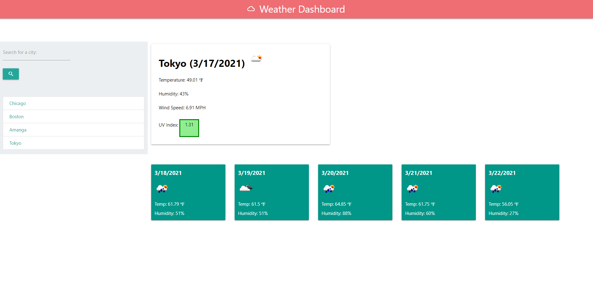

# Weather Dashboard

A simple yet effective weather application to meet all your need-to-know weather needs. 

#### Deployed Link: 

## Description
This application can tell you weather information based on your city search. Simply enter in the city you are interested in and the application will do the rest! Get today's date, weather icon, temperature, wind speed, humidity, and UV index. The application will also give you the projected forecast for the next five days, to plan around your busy lives. 

Previous searches will be saved, so you can always go back and check out the city's weather again!

## Functions of the Weather Dashboard
- User can input a city name and receive weather information on today's date and the 5-day forecast. 
- Inputed cities will be saved for the user to click on and call for the city's weather. 
- Present day's weather will include the date, temperature, humidity, weather icon, UV Index, and wind speed. 
- The five day forecast includes the date, temperature, weather icon, and humidity

